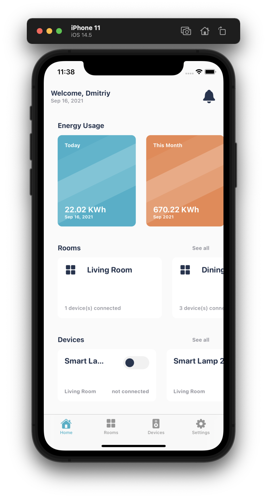
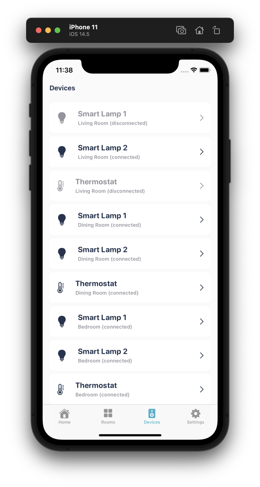
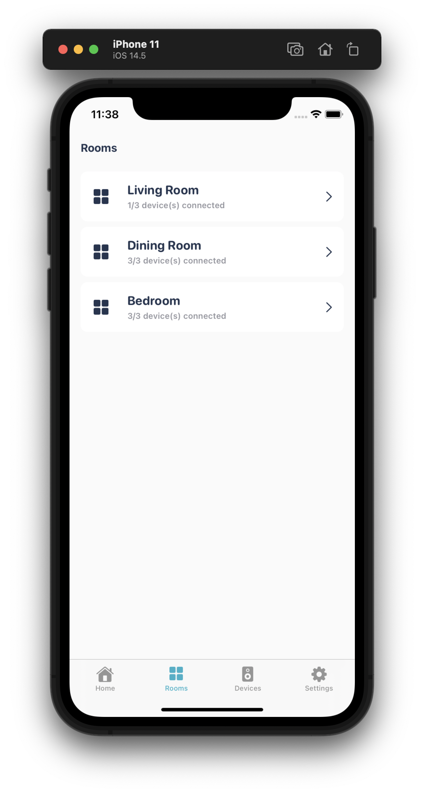
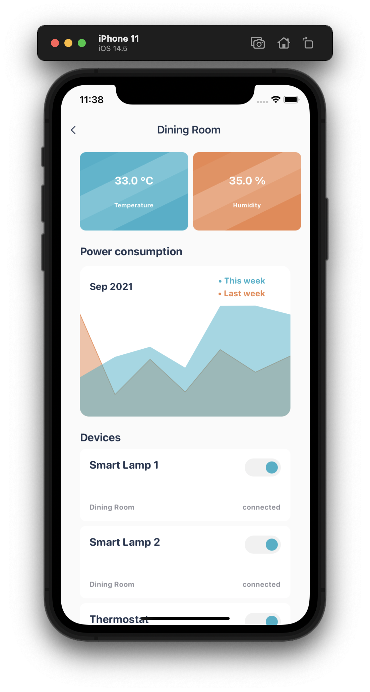

# Smart Home Mobile App UI #

SwiftUI implementation of [Smart Home Mobile App UI](https://dribbble.com/shots/16110387-Smart-Home-Mobile-App) design by [Lokanaka](https://dribbble.com/Lokanaka) from dribbble.com.

  
  
  
  

